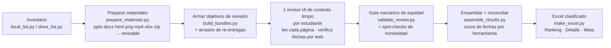

# 🏛️ vigilancia-tech-review

**Universidad de los Andes · MBA · Reto Integrador 1 – Tecnología de Información**

*Revisión, calificación y ranking asistidos por IA de las presentaciones estudiantiles de "Vigilancia Tecnológica" — construido por el equipo docente del curso.*

---

Skill agéntico que revisa **todas** las entregas estudiantiles de la actividad
*Vigilancia Tecnológica: IA de vanguardia* del MBA de Uniandes y entrega al equipo
docente un Excel clasificado y codificado por colores. Nunca asigna la nota oficial:
produce puntajes candidatos con evidencia citada y una preselección top-5.
**La nota oficial siempre requiere revisión humana.**

## Por qué existe

Más de 75 estudiantes entregan cada semana presentaciones (y documentos Word, páginas
HTML, capturas, videos, hojas de cálculo…). Revisar cada una con honestidad — leer cada
slide, verificar en la web la fecha real de lanzamiento de la herramienta, comprobar que
la evidencia es propia — le toma días al equipo docente. Este skill hace la primera
pasada exhaustiva en menos de una hora y entrega una preselección defendible con
justificaciones que citan slides concretas.

## Qué hace

- **Todo formato se revisa.** Un `.docx`, una captura o un video es una entrega — el
  formato nunca es motivo para saltarse ni descalificar a un estudiante (regla dura de
  equidad del skill).
- **Las fechas de lanzamiento se verifican por web** contra anuncios oficiales;
  herramientas con más de 4 meses → 1.0 automático, con banda fronteriza (3.5–4.5
  meses) marcada para revisión humana.
- **Rúbrica:** Prueba de concepto 50% · Análisis de impacto 25% · Comunicación 25%,
  escala 1.0–5.0, calculada en un único lugar.
- **Maquinaria anti-descuido:** validación mecánica por revisión (formatos estrictos de
  campos, vocabulario cerrado de flags), spot-checks de honestidad contra las páginas
  reales, manejo de entregas duplicadas con arrastre de evidencia, y reconciliación de
  fechas entre estudiantes que presentaron la misma herramienta.
- **Todo lo que ve el docente sale en español** — la clase se dicta en español.
- **Estados más allá de calificado:** `REVISADO (ANEXO)` (archivo leído dentro
  de la revisión integral del estudiante), `REEMPLAZADA` (versión anterior o
  duplicado) — más columnas advisory `Indicio IA (1-5)` (señal de IA sin
  filtrar, nunca parte de la nota) y `Feedback sugerido` por estudiante.

## Agnóstico al harness por diseño

El skill habla en lenguaje de capacidades (ver `SKILL.md`); los adaptadores por
plataforma lo traducen a herramientas concretas:

| Tu harness agéntico | Adaptador |
|---|---|
| **Claude Code** (Claude) | [`references/claude-code.md`](references/claude-code.md) |
| **Codex CLI** (GPT) | [`references/codex.md`](references/codex.md) |
| **Antigravity** (Gemini) | [`references/antigravity.md`](references/antigravity.md) |
| Cualquier otro con visión + búsqueda web | sigue la lista de capacidades de [`SKILL.md`](SKILL.md) |

Los harnesses sin visión nativa de páginas PDF usan el rasterizador incluido
(`scripts/pdf_to_images.py`, PyMuPDF).

## Mapa del repositorio

| Ruta | Qué es |
|---|---|
| `SKILL.md` | El skill — procedimiento, reglas de equidad, capacidades requeridas |
| `scripts/local_list.py` | Inventario de carpeta local / Canvas / Drive Desktop (rutas largas seguras) |
| `scripts/drive_list.py` · `drive_download.py` | Listado + descarga anónima de Drive compartido por enlace |
| `scripts/prepare_materials.py` | Todo formato entregado → algo que el revisor puede VER |
| `scripts/pdf_to_images.py` | PDF → PNGs por página (harnesses sin visión de PDF) |
| `scripts/build_bundles.py` | Objetivos de revisión por estudiante + arrastre de re-entregas |
| `scripts/validate_review.py` | El gate mecánico de equidad (fuente única de verdad) |
| `scripts/assemble_results.py` | Fusión de dos pasadas + reconciliación por herramienta |
| `scripts/convert_to_pdf.py` · `make_excel.py` | Diapositivas→PDF · Excel final |
| `scripts/merge_rounds.py` | Maestro multi-ronda — hojas por ronda + `Histórico` transversal; las rondas anteriores jamás se borran |
| `templates/` | Prompts del revisor (español): entrega simple + bundle multiformato |
| `references/` | Adaptadores por plataforma |
| `docs/specs/` | Planes de diseño y de corrida |

## Requisitos

Python 3.10+ · `pip install -r requirements.txt` · backend diapositivas→PDF
(LibreOffice u Office COM) · Chrome/Edge headless para HTML · `ffmpeg` para videos.
En Windows: lee la sección MAX_PATH de `SKILL.md` antes que nada.

## Licencia

**[Licencia Académica Uniandes](LICENSE.md)** — código visible, no open source:

- Cualquiera puede **ver, descargar, ejecutar y probar** el skill con fines
  **académicos y no comerciales**.
- **La modificación y las obras derivadas están reservadas a profesores, TAs y
  personal de la Universidad de los Andes.**
- Sin uso comercial; sin calificar estudiantes reales fuera de Uniandes sin
  autorización escrita. Los datos de estudiantes jamás entran a este repositorio.

---

Hecho con cuidado para el equipo docente del MBA de Uniandes · Bogotá, Colombia 🇨🇴

