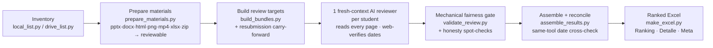

# 🏛️ vigilancia-tech-review

**Universidad de los Andes · MBA · Reto Integrador 1 – Tecnología de Información**

*AI-assisted review, scoring, and ranking of student "Vigilancia Tecnológica" presentations — built by the course teaching team.*

**📖 [Documentación completa en español → README.es.md](README.es.md)**

---

An agent skill that reviews **every** student submission for the Uniandes MBA activity
*Vigilancia Tecnológica: IA de vanguardia* and delivers a ranked, color-coded Excel for
the human teaching team. It never assigns the official grade — it produces
evidence-cited candidate scores and a top-5 shortlist. **Official grades always require
human review.**

## Why it exists

75+ students submit decks (and Word docs, HTML pages, screenshots, videos, spreadsheets…)
every week. Reviewing each one honestly — reading every slide, verifying the tool's real
launch date on the web, checking the evidence is the student's own — takes the teaching
team days. This skill does the exhaustive first pass in under an hour and hands humans a
defensible shortlist with slide-cited justifications.

## What it does

- **Every format is reviewed.** A `.docx`, a screenshot, or a video is a submission —
  format is never a reason to skip or disqualify a student (the skill's hard fairness
  rule).
- **Launch dates are web-verified** against official announcements; tools older than 4
  months → automatic 1.0, with a human-flagged border band (3.5–4.5 months).
- **Rubric:** Prueba de concepto 50% · Análisis de impacto 25% · Comunicación 25%,
  scale 1.0–5.0, computed in exactly one place.
- **Anti-sloppiness machinery:** per-review mechanical validation (strict field formats,
  controlled flag vocabulary), honesty spot-checks against the actual pages, duplicate-
  submission handling with evidence carry-forward, and cross-student same-tool date
  reconciliation.
- **Everything teacher-facing ships in Spanish** — the class runs in Spanish.
- **Audio submissions are first-class**: `.mp3/.wav/.m4a/…` get duration + an
  optional transcript (`--transcript=<folder_id>#<n>=<file>`, indexed so a
  multi-track folder can never be mis-attached). Speech without a transcript is
  flagged, never guessed; a non-speech artifact generated by the tool under
  review counts as the student's own evidence.
- **DQ grade policy is configurable** (`make_excel.py --dq-policy`): default `cap:3.0`
  keeps a disqualified student's rubric grade visible (`Nota rúbrica`) and caps the
  final at 3.0 — the TA team's calibration after round 1; `fixed:N`, `rubric`, `legacy`
  (automatic 1.0) available. DQ rows also get a bidirectional adversarial date re-check.
- **Row states beyond graded:** `REVISADO (ANEXO)` (file read inside the
  student's integral review), `REEMPLAZADA` (older version/duplicate) — plus
  advisory columns `Indicio IA (1-5)` (unfiltered-AI signal, never part of the
  grade) and a per-student `Feedback sugerido` draft. A `Clave` column (stable
  Canvas student id) keys the multi-round `Histórico`, immune to display-name
  drift between rounds.

## Harness-agnostic by design

The skill speaks capability language (see `SKILL.md`); per-platform adapters map it onto
concrete tools:

| Your agent harness | Adapter |
|---|---|
| **Claude Code** (Claude) | [`references/claude-code.md`](references/claude-code.md) |
| **Codex CLI** (GPT) | [`references/codex.md`](references/codex.md) |
| **Antigravity** (Gemini) | [`references/antigravity.md`](references/antigravity.md) |
| Anything else with vision + web search | follow the capability list in [`SKILL.md`](SKILL.md) |

Harnesses without native PDF-page vision use the bundled rasterizer
(`scripts/pdf_to_images.py`, PyMuPDF).

## Repository map

| Path | What it is |
|---|---|
| `SKILL.md` | The skill itself — procedure, fairness rules, capability requirements |
| `scripts/local_list.py` | Inventory a local / Canvas / Drive-Desktop folder (long-path safe) |
| `scripts/drive_list.py` · `drive_download.py` | Anonymous link-shared Drive listing + download |
| `scripts/prepare_materials.py` | Every submitted format → something a reviewer can see |
| `scripts/pdf_to_images.py` | PDF → per-page PNGs (non-PDF-vision harnesses) |
| `scripts/build_bundles.py` | Per-student review targets + resubmission carry-forward |
| `scripts/validate_review.py` | The mechanical fairness gate (single source of truth) |
| `scripts/assemble_results.py` | Two-pass merge + same-tool reconciliation |
| `scripts/convert_to_pdf.py` · `make_excel.py` | Slides→PDF · final ranked Excel |
| `scripts/merge_rounds.py` | Multi-round master workbook — per-round sheets + cross-round `Histórico`; prior rounds are never deleted |
| `templates/` | Reviewer prompts (Spanish): single-deck + multi-format bundle |
| `references/` | Platform adapters |
| `docs/specs/` | Design/run plans |

## Requirements

Python 3.10+ · `pip install -r requirements.txt` · a slides→PDF backend (LibreOffice or
MS Office COM) · headless Chrome/Edge for HTML · `ffmpeg` for videos. Windows users:
read the MAX_PATH section in `SKILL.md` before anything else.

## License

**[Uniandes Academic License](LICENSE.md)** — source-available, not open source:

- Anyone may **view, download, run, and test** the skill for **academic,
  non-commercial** purposes.
- **Modification and derivative works are reserved to Universidad de los Andes
  teachers, TAs, and staff.**
- No commercial use; no grading real students outside Uniandes without written
  authorization. Student data never enters this repository.

---

Built with care for the Uniandes MBA teaching team · Bogotá, Colombia 🇨🇴

